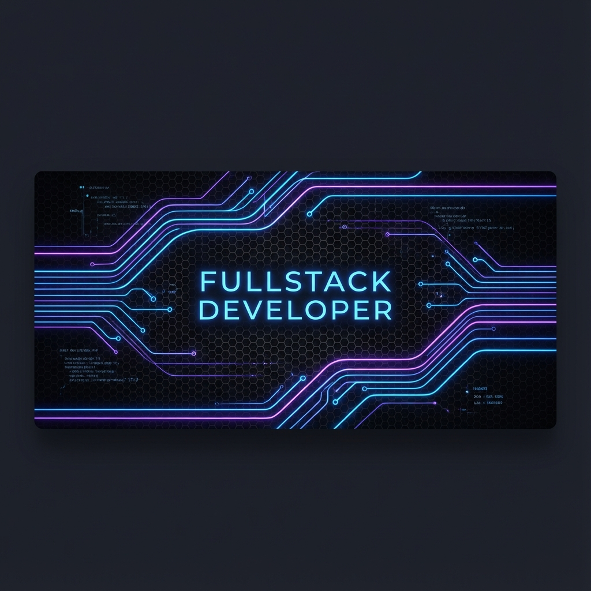

# 👋 Halo, Saya [Nama Anda]!

  

  

  
  

---

### 🚀 Tentang Saya
Saya adalah seorang **Fullstack Developer** yang bersemangat untuk membangun solusi teknologi yang inovatif dan berdampak. Saya senang mengeksplorasi teknologi baru dan berkontribusi pada proyek open-source.

- 🔭 Sedang mengerjakan: **[Nama Proyek Utama]**
- 🌱 Saat ini sedang mempelajari: **Next.js 14, TypeScript & AI Integration**
- 👯 Saya terbuka untuk kolaborasi: **Proyek Open Source & Startup Tech**
- 💬 Tanya saya tentang: **React, Laravel, atau UI/UX Design**
- ⚡ Fun fact: **Saya suka ngopi sambil ngoding di malam hari! ☕**

---

### 🛠️ Tech Stack & Tools

  

---

### 📊 Statistik GitHub (Interaktif)

  
  

  

---

### 🕹️ Kontribusi Saya (Snake Animation)
<!-- Ini adalah elemen interaktif yang populer. Kamu perlu setup GitHub Action untuk merender ini. -->
<picture>
  <source media="(prefers-color-scheme: dark)" srcset="https://raw.githubusercontent.com/Cococip/Cococip/output/github-contribution-grid-snake-dark.svg">
  <source media="(prefers-color-scheme: light)" srcset="https://raw.githubusercontent.com/Cococip/Cococip/output/github-contribution-grid-snake.svg">
  
</picture>

---

  <i>Bintang-bintang tidak akan bersinar tanpa kegelapan. Teruslah berkarya! 🚀</i>

